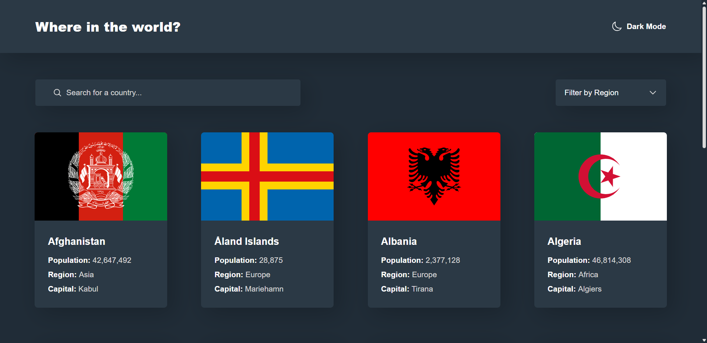
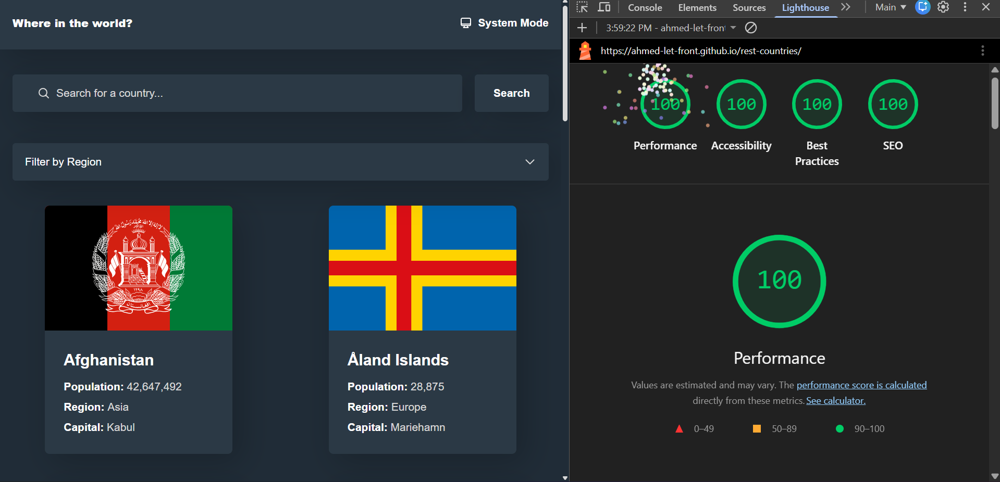
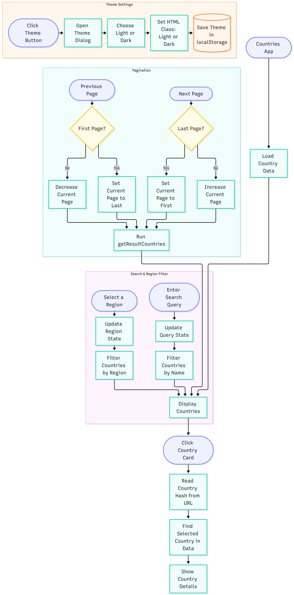

# REST Countries App

## Overview & Project Scope

Welcome to the **REST Countries App**, a modern, highly responsive, and feature-real web application designed to explore countries worldwide. It allows users to seamlessly search, filter by region, view detailed country statistics, and toggle between visual themes, all while adhering to modern UI/UX patterns and top-tier performance standards.

## Hero Preview



## Links

- **Live Demo URL:** [https://ahmed-let-front.github.io/rest-countries/](https://ahmed-let-front.github.io/rest-countries/)
- **Frontend Mentor Solution:** [https://www.frontendmentor.io/challenges/rest-countries-api-with-color-theme-switcher-5cacc469fec04111f7b848ca](https://www.frontendmentor.io/challenges/rest-countries-api-with-color-theme-switcher-5cacc469fec04111f7b848ca)

## Lighthouse Performance Audit



## AI Collaboration

- 🤖 **UI & Layout Assistance:** AI collaboration was utilized exclusively to assist with structuring and refining the user interface (UI) and layout architecture. All core application logic, API integration, and programming were independently engineered and implemented by the author.

---

## Logic Flowchart



---

## Core Features & Logic Pipelines

### ⚠️ IMPORTANT NOTE ON DATA SOURCE:

## Please note that this application does not rely on a live external API call. Instead, it efficiently fetches and processes data from a local JSON dataset bundled within the project repository. This approach ensures maximum reliability, lightning-fast response times, and zero third-party downtime risks!

- 🌍 **Comprehensive Data Explorer:** Fetches and displays exhaustive data from the REST Countries API, including flags, populations, regions, capitals, borders, and currencies.
- 🔍 **Real-Time Search & Region Filtering:** Instant query filtering by country name combined with quick dropdown filtering by world region.
- 📄 **Detailed Country Views:** Dedicated detail panels showcasing bordering countries that link directly to their respective pages.
- 🎨 **Interactive Theme Switcher:** Seamless switching between light and dark themes with persistent user preference storage.
- ⚡ **Optimized Performance & State Management:** Built using clean architectural patterns with efficient caching and LocalStorage state persistence.

## Tech Stack & Implementation Details

- 🧱 **Semantic HTML5 Markup:** Clean, accessible, and structured DOM hierarchy.
- 💻 **Vanilla JavaScript (ES6+ Modules):** Modularized architecture leveraging modern ES6 features (`async/await`, custom iterators, and event delegation).
- 🎨 **Tailwind CSS v4:** Utility-first styling utilizing advanced features, CSS variables, and modern features like `starting-style` and `transition-behavior: discrete` for smooth dialog/modal animations.
- ⚡ **Vite:** Next-generation frontend tooling ensuring ultra-fast HMR and optimized production builds.

## What I Learned & Architectural Highlights

Building the REST Countries application deepened my expertise in handling asynchronous JavaScript, managing complex API data structures, and organizing code modularly.

A key highlight was mastering modern CSS animation techniques and browser APIs:

- Utilizing `transition-behavior: discrete` alongside `@starting-style` to enable smooth entry and exit transitions on elements transitioning from `display: none`.
- Implementing `window.matchMedia` listeners dynamically to synchronize theme adjustments and responsive layout states.
- Structuring modular components to handle dynamic routing, URL parameters, and border-country navigation cleanly without full page reloads.

Here is a snippet of the custom state and API handling logic implemented in the project:

```javascript
// Example snippet handling asynchronous country data fetching and error management
const fetchCountriesData = async () => {
  try {
    const response = await fetch('https://restcountries.com/v3.1/all');
    if (!response.ok) throw new Error('Failed to fetch countries data');
    const data = await response.json();
    return data;
  } catch (error) {
    console.error('Error loading countries:', error);
  }
};
```

---

## Project Initialization & Local Setup

To run this project locally, follow these steps:

### 1. Clone the repository:

```bash
git clone https://github.com/Ahmed-let-front/rest-countries.git
```

### 2. Navigate to the project directory:

```bash
cd rest-countries
```

### 3. Install dependencies:

```bash
npm install
```

### 4. Start the development server:

```bash
npm run dev
```

### 5. Build for production:

```bash
npm run build
```

---

## Vite Build Configuration

The project uses an optimized **vite.config.js** file tailored for production asset bundling and vendor chunk splitting:

```javascript
import { defineConfig } from 'vite';
import tailwindcss from '@tailwindcss/vite';

export default defineConfig({
  plugins: [tailwindcss()],
  base: '/rest-countries/',
  build: {
    sourcemap: false,
    rollupOptions: {
      output: {
        assetFileNames: 'assets/[name]-[hash][extname]',
        chunkFileNames: 'assets/[name]-[hash].js',
        entryFileNames: 'assets/[name]-[hash].js',
        manualChunks(id) {
          if (id.includes('node_modules')) {
            return 'vendor';
          }
        },
      },
    },
  },
});
```

---

## Author

- GitHub: [ahmed-let-front](https://github.com/Ahmed-let-front)
- Frontend Mentor: [Ahmed yasser](https://www.frontendmentor.io/profile/Ahmed-let-front)
- LinkedIn: [Ahmed Yasser](https://www.linkedin.com/in/ahmed-yasser-frontend/)

---

**Thanks** Created By **Ahmed Yasser** ❤️
